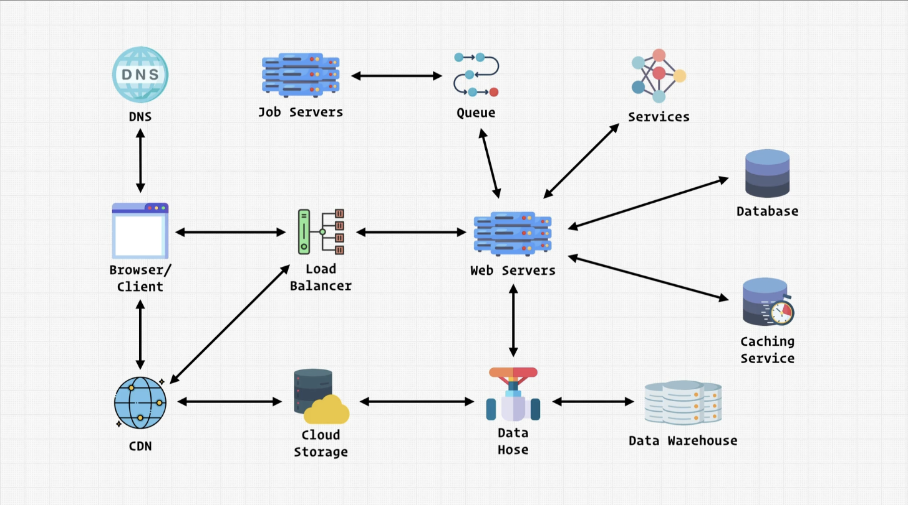

# System Design & Architecture

I don't wnat to be descouraging, but, System Design & architecture is an _Hard_ topic. This is because it's the real measure to evalute how much a programmer has **experience**, and not how much skills/knowledge he/she has.

Ok. Let's start.

In the first place, what are this actual systems we are designing in the first place?

Before we start digging on how you make the actual decision when it comes to designing a specific system we need to understand at a high level what are this systems and what are the environments where they live in.

## Architecture

The architecture is a really complex and composed part of a project.

Here's a "simple" diagram that represent a system architecture (image picked from a course of "Zero To Mastery"):

Every complex and weel structured system is probably very similar.
We'll See each of the components that define a system design in detail.

### Browsers

This is the simplest one, which we all are kind of familiar with: **Browsers/Client**. You're interacting with it right now if you are reading this notes (or maybe you downloaded them... I don't know).
An example of a browser application, is, of course, Chrome, or Safari, or again Firefox.
A client, is something more direct, so, the application on its own (like the Facebook application). You can access the application directly.

Now that we know what is a Browser and what is a client, what does it does whenever you utile a browser/client?

When you type the url to access a web application, what happens?
The browser wants to access the url, so It requests the files to build that website to the server that holds all of those files.
It will then response with the appropriate files/data to build the application.

But, this does not fit well in a real world scenario, where millions of users whant to access the same resources at the same time. Here we can place other components that allow us to scale better, such as DNS, CDNs, Load Balancer, and more servers.

### DNS

Let's see another piece: **DNSs**. We mentioned it in the previous section. Whar is the DNS?

DNS stands for **Domain Name System**. A domain is simply the _unique name_ that is actually human readable. To the computer, it dosn't say anyhing, but what is important to it, is the _unique_ **IP address** associated with that domain, located somewhere in the web.
The DNS maps all the IP addresses to a specific domain. Big companies actually have thousands or maybe millions of different IP addresses, and the reason is that there will actually be a lot of servers that can serve the same files, in different world locations (the nearest to the user).

The IP address is usually in the **IPv4 protocol**, but, because the number of websites, domains, and servers, is constantly inscreasing, IP addresses now should use the **IPv6 protocol**, which offers 3.4 x 10^38^ number of different IP addresses.

So, now that we know this, let's get back a moment.

You type the URL in a browser search bar, and the first thing that the browser will do, will be a request to the DNS to get the correct IP address corresponding to the domain of the specified URL. When the browser gets it, it will be able to make requests to the server with the same IP address.
The browser can actually request only the IPv4 address, only the IPv6 address, or both.

### Web Servers

When the browser receives its IP address, it can then request resources to the target server. This server is called **Web Server** (or **Web Application**). The browser can requst resources for the whole application or just for a portion of it (maybe, for example, some data that you request when you scroll the page).

The client doesn't know anything about what to do. The web server does.

The core thing that makes a web server work is something that allows the server to the **run business logic** (the low level code you wrote, in Java, Javascript, PHP, and so on) and the Database.

In order to handle all the millions requests that the Web Server can receive from users, it actually have to consume resources, which are:

* Storage (HDD, SSD)
* Memory (RAM)
* Processing power (CPU)
* Network speed

To handle a lot of requests, you can scale your web server in two ways:

* **Vertical** - You have your web server and you need more resources to handle more requests. So, you increase storage, memory, and so on, based on the need.
* **Horizontal** - You duplicate/clone the server multiple times (virtually, or not). In This type of scaling, you actually have to implement a **Load Balancer**

### Load Balancers

As we said, to handle more requests you can horizontally scale the web Server by duplicating _the application logic_ (which is the important part here) in other Web Servers. Anyway, all these servers connect to the same database (usually, but not necessarily). Each Web Server its called "**node**".

But, with multiple servers, you have to handle the amount of traffic (load) each server its receiving. I mean, it would be useless to have a lot of servers if all the requests still go to a single Web Server.
So, how can you handle all the requests? Here comes the **Load Balancer**.

A Load balancer distribute the amount of requests between the servers available. It acts as a midlleware between the browser and the server, and choose in which server have to send the request based on the choosen **strategy**.
The most common strategy is the **Round Robin**. It simply send requests in order to a different server (first in server A, second in server B, and repeat). Alothough, in theory, it's good, in real life situations, this might not be as goog as it seems, beacuse a server can still be more "full" than other beacuse it's handling a more "heavy" request.

A load balancer is also smart enough to handle critical situations, like if a Server goes down, so it will distribute requests to all the other servers.

With load balancers, you also have to consider "Session persistence". A load balancer must keep track of the current session between a client and a server, and this connection must be kept for all the next requests. So, it will always pass the connection between the correct client and server.

If a server goes down with all its sessions, the load balancer will have to re-distribute connections between each node.
The session informations can then be retrieved in the client or in the load balancer itself.

For now, it's all about load balancers, but maybe we will cover more later (or myabe not It will be a surprise).

### Databases

Let's see _on a high level_ how web servers communicate with **databases**.
I said "on a high level" because we will actually cover all the possible databases and when to choose one over the other in a leter section. Here, we will only see the realtionships between web servers and databases, as I said.

We know that Web servers runs our **Business Logic**. This logic must work on some data, which is stored in databases, which store and retrieve data. But, all this operations are kind of... slow. In fact, this operations are the "heaviest" and cause the most latency in requests between clients and servers.

When doing repetetive work, we can store the information in a caching system, which is next piece of the puzzle.

### Caching

**Caching servers** can make the interaction between clients, servers, and Databases _much faster_. Cache servers prioritize _speed of retrieval_ over _amount of data stored_. It's designed to store significantly less data, and this makes the access to those data a lot faster.
The first user requesting some data will activate a procedure that at the end will store those data in the cache system, so that the next user can access the most recent data much much faster.
For every next request, before requesting data to the DB, the server will first check if the data are available in the cache system. If not, the server will then cache the data.
Of course, the cache will be updated constantly, so that you always have the most recent data at the minimum latency.

### Job Servers

Now that we covered the most "basic" components in our schema, let's see some more difficult/complex components.

Particularly, we're going to talk about **Job Queues** and **Job Servers**.

What is a Job Queue and Job Server?

But, first, what is a **Job**?
Jobs are a very core component of large distributed systems.
With Web Servers, we said that we handle **Business Logic**, which is any code that you write that have to interface directly with the user. Everything else, is what we can call **Application logic**, which is what the Job Server handles.
In a practical example, the application logic can be the code that query the data sources to get the data (not necessarily from the database).

> Job = 1 Unit of Work

In general:

> Everything that is not user-driven and live outside of the application, is the **Application Logic**.

### Job Queues

How does the Job Server know when it should stop running a Job?
Here comes the **Job Queue**.

Ok. Job Queues. But, what is a **Queue**?
A queue is esentially a "line" of different pieces that should be executed in order of arrival. So, the first process to come is also the first process to be executed (so the first to exit the queue). This is called a **FIFO queue** (First In First Out). More specifically, there are also **Priority Queues**, which means that the processes will be executed based on the priority they have. The elements with the same priority will be executed in the same order they arrive in the queue (FIFO).

So, the Job Queue is simply a Queue that _receives orders from the Web Server and pass them to the Job Server_ based on the priority that the Web Server assign to each of them.

### Services

We covered the main components that build the fundamental functionalities of a system, but now we can talk about some abstractions.

We can so first talk about **services**.
You can think of services like some piece of functionality that the application offers. For example, the authentication service, or the news feed, or again the Messenger service in Facebook.
You can build this pieces of software as services of your application by creating "endpoints" to access those services (like API routes).
Each service is specialized on completing a specific group of tasks (e.g. the authentication service is specialized on login, sign out, registration).

Each service can be considered as another architecture block on it's own. What I mean by with that, is that a service can have it's own Load balancer, Web Server, database, and so on.
So, for example, if a client request to be authenticated, it pass the request to the load balancer, than to the Web server that go in the authentication service. The authentication service will then have another load balancer that send the request in one of its web servers, which will then connect to a Database.

Things are starting to be complicated, aren't they?

### Data Hose & Data Warehouse

What we're going to talk about now is **Data Hose** and **Data Warehouse**.

First of all, let's talk about data. What kind of data are we talking about?
Any interaction that a user make in a website is usually registered, analyzed, and collected so that the owner of the website can easly know how to optimize pages. This collection of data is often done by tools like Google Analytics, Matomo, and so on.

We can do these operations passing from the Web Server or even directly from the Browser/client to the Data Hose.
The **data Hose** is responsible from "translating" the Raw data obtained to more readable data. Then, it will send both in the **Data Warehouse**, which is just a place where you store permanently those data.

Just this.

### Cloud Storage

**Cloud Storage** is actually pretty simple. Essentially, is just a backup source of data, and it lives on the cloude so that the data are not in your local machine.
Aaaaand that's it :D.

### CDN

CDN stands for Content Delivery Network, and its purpose is to make much more performant the delivery of the content of our webisite all around the world. A CDN is going to hold all the files that the browser needs, and the CDN will serve this file to the most nearby user requesting those files.

Having more CDNs _all around the world_ reduces a lot the latency of the requests from the browser to the server, because the use will access the most nearby server rather than the "original" one (e.g. An american user will access a CDN located in San Francisco, rather than another CDN located in Frankfurt).

## System Design

Let's talk for a minute about the goal of studying System Design.
System Design is an encredibly _expensive_ topic, but it's one of the most FAANG companies interviews.
System Design it's the true gage of your seniority, and that's why system design questions comes up only for **Senior Developer** roles.
We're going to tackle what it means to really understand what system design is for.

> Engineer and build systems that meet the needs of the business in a coherent, efficient and organized way.  We do this by designing the **architecture**, the **interfaces**, and the **data**.

This last 3 words are really the keys: Architecture, Interfaces, and Data.

There are two core principles that drive System Design:

* Availability
* Reliability

### Availability

**Availability** is pretty much the percentage of time within some given period that your system/application can actually be used and will perform the desired function it was supposed to do.
In other words, availability is being able to access a service 24/7 (possibly).

$$
availability = \frac { uptime } { uptime + downtime }
$$

The _uptime_ is the **functioning**, while the _uptime + downtime_ is the **timeframe**.

So, for example, if the service is up for 300h but down (for maintenance) for 15h, the availability is calculated like this:

$$
availability = \frac { 300 } { 300 + 15 } = 95.2\%
$$

There is a little scale that shows what are the most common availability achivements:

**Timeframe = 1 Month**

| Name | Percentage | Downtime |
| ---- | ---------- | -------- |
One Nine | 90% | 72 hrs |
Two Nines | 99% | 7.2 hrs |
Three Nines | 99.9% | 43.8 mins |
Four Nines | 99.99% | 4.32 mins |
Five Nines | 99.999% | 25.9 secs |
Six Nines | 99.9999% | 2.59 secs |
Seven Nines | 99.99999% | 263 msecs |
Eight Nines | 99.999999% | 26.3 msecs |
Nine Nines | 99.9999999% | 2.6 msecs |

Usually an agency aim to three/four nines, but a service that for example is about health should aim to an availability of nine nines, which is really difficult and must have a well designed architecture and system.

### Reliability

Reliability is all about rather or not within your system, it crashes or it break downs and create some kinf of failures when it's been accessed.

The formula for calculating reliability is the following:

$$
Mean Time Between Failure = \frac{Total Time In Service}{Number Of Failures}
$$

Let's say the total time in service is 300h and the number of failures are 5:

$$
Mean Time Between Failure = \frac{300}{5} = 60hrs
$$

### Networking

Networking is essentially how one computer/system commununicate with another computer/system. There are two possible models which can be this communication possible:

* **OSI**
* **TCP/IP**

This can be so complicated that you can actually work as a Networking Enginner, so we're going to only see the high view of it.

#### OSI

**OSI** stands for _Open System Interconnection_, and is a general model for the network communication within two systems. It breaks up the communication is 7 layers, each with its own protocol:

7. **Application Layer** - Holds things that are closer to the user, such as the browser, which uses the HTTP protocol
6. **Presentation Layer** - Also known as "Translation Layer", the data that we get from appication layer are extracted, manipulated, and formatted so they are ready to be transported across the network.
5. **Session Layer** - It's responsible for opening and closing the communication between two devices.
4. **Transport Layer** - It's the one responsible for end-to-end communication. It makes sure that the communication _happens_.
3. **Network Layer** - It's responsible for communications between inter/intra networks. Facilitates communication between major groups of networks (e.g two separate LANs).
2. **Datalink Layer** - Facilitates communication between two devices on the same network.
1. **Physcal Layer** - It has to do with the actual transfering bits of data in physical cables.

#### TCP/IP

**TCP/IP** stands for _Transmission Control Protocol/Interner Protocol_.
We kinda already know what an IP is, so we can obmit the "/IP" part and focus on the "TCP" part.

The Transfer Control Protocol it's connection oriented meaning that we try to enstablish a connection between two devices and we want a stable connection so that we can send data to each other. It's designed to ensure that data do actually get transferred completely, and it's the best protocol for this reason.
We always want to be ensure that data are sent.

TCP/IP have 4 layers:

4. **Application Layer** - Represent layers 7,5,4 of ISO
3. **Transporter Layer** - Represent the 4th layer of ISO
2. **Internet Layer** - Represent the 3rd layer of ISO
1. **Network Access Layer** - Represent the 1st and 2nd layer of ISO

TPC can also be used in conjunction with UDP. It also get data from one source to another, and both are connection oriented.

How TCP works?

There is a first step, which is **ISN** (_Initial Sequence Number_), that consist on being sure the first data are sent and received correctly. Both the Client and Server have randomly generated ISN.
So, for example, the client will send a **SYNchronize with ISN = X** to the Server, which will send an **ACKnowledge ready for X+1** and send a **SYNchronize Y** with the Client, which again will send an **ACKnowledge ready for Y+1**.
Hope it's understandable. XD
The data will then have an ISN of X+1 (because the serve acknowledged to that) for the client and a Y+1 for the server (because the cliente acknowledged to that).

#### UDP/IP

**UDP** stands for _User Datagram Protocol_. The thing about UDP is that it's _much faster_ than TCP because there is no connection: this is a connectionless protocol. This means that you don't have to worry about the first operation of "X, Y, X+1, Y+1" ecc... Simply, the client send a request to the server and the server keeps sending over and over some data, hoping that the client receives all of them, but if it doesn't, that's not a server's problem.
So, there is not gurantee of data delivery.
UDP use cases are something like calls, video streams, and something like this, because even if some data are not delivered, you still are able to hear/watch the other data.

### Proxies

What is a **proxy**? A proxy is something that sits between the client and the internet, so the client will never access directly the internet but is first interfaced with the proxy, which will hide the details of all the client. It can modify all the requests, because it has all the access to all the informations and have full control of them.

There are two types of proxies:

* **Forward Proxy** - Sits between the client and the internet.
* **Reverse Proxy** - Sits between the server and the internet.

It kinda behave like a load balancer, isn't it? The only difference is that the load balancer is built to handle many requests and distribute them into multiple nodes, while the proxy is built to modify a request and send it to the internet.

### Load Balancing stategies

There are actually a few ways to expand our reliability of our network with load balancers.
The component we're going to use is not a "pure" load balancer but a **Reverse Proxy/Load Balancer**.

We talked about the **round robin** strategy, which is very rudimentary.
The main problem of round robin is that usually each server have not the same amount of resources of another one, so each one will act differently for each request.

Another load balancing strategy is the **Weighted Round Robin**. Weighted round robin offers to each node a fixed number of requests, as specified by the configured weight which serves to influence the portion of capacity received by each queue or task. I took this defintion from wikipedia because I really didn't know how to explain it.

Then ther is the **Least Connection** strategy, we pass the request to the server that has less connections, so, if the server1 has 4 requests, server2 2, and server3 1, the load balancer will sent the request to the server3.

There are also **redundant load balancers**, beacuse if a load balancer breaks, the entire system breaks too. Of course, this would be a complete disaster. We must avoid all the "_single points of failures_", so we want a redundant load balancer (or backup load balancer) that can replace the original one if it breaks. Of course, this increase the complexity of the system.

### Clustering

It's a very commong technique in every system, which you apply into a specific component and basically you increas the amount of servers that exists, but in a different way that you might be thinking.

Load balancing and clustering are often used in conjunction.

> Clustering is when you have a bunch of servers that **act together**.

Each of these servers are known as "nodes", and each of them has the **same IP address**, so in schemas you actually rapresent a single server, even if it's composed of multiple clustered servers.
Each of them share its state with the other, so if you breaks, the others know it and will balance the requests. Their identical servers, so they have the same resources (but they don't share them!).

### Databases

We're begginning our deep dive into the databases.
When designing a system, you really have to consider if you should use or not a relational database, and after that, how to structure the data (tables).

* SQL - relational database.

#### CAP Theorem

**CAP theorem** is a way of thinking about distributed systems (especially databases) and what type of **databases** to choose regarding of your data.
Let's see first what CAP stands For:

* C - **Consistency**
* A - **Availability**
* P - **Partition tolerance**

A system can oly be two things of these 3, so you can have a system which is **CA** (Consistent and Available), **CP** (Consistent and Partition Tolerant), and **AP** (Available and Partition Tolerant).

Generally speaking, to a system which is distributed, it always have at least a partition tolerance, so it's rather a CP or AP system.

What is the **partition tolerance**? The partition tolerance is the ability of a database to split up into different databases, and that's why in production of distributed systems, you have to _garantee_ the ability for these databases to communicate to each other. With that in mind, you must consider the partition tolerance when talking about distributed systems.

What is **Consistency**? Consistency is the ability of a database to equally distribute the same information in all databases, meaning that, for a query, they all return the same result. So, basically, for each operation in the database, it also replicate the operation to all the other databases.

Finally, what is **Availability**? Availability is the ability of a database to always return something regardless of rather or not a partion is detected in the system and the data is stale. So, an available database will always return something even if the data are not garanteed to be up to date because the current database is down. A system which is not available would throw an error or something.

Know what all these property does, it's easy to get why all the three can't live in conjuction.

A **CA** Systems will have a single node, so, it's not a distributed system

Now, when you should choose a CP systems over an AP system?
Let's first see two new terms: **ACID**, and **BASE**.

**ACID** stands for:

* **Atomic** - An atomic database must ensure that all transactions are atomic, which means that a single record at a time shoudl be updated/deleted/ecc... If something goes wrong to an operation, the database must be able to rollback the transaction.
* **Consistent** - Between every transaction, the database and all of its nodes are consistent in data. Every transaction that happens does not compromise the structure of the database itself.
* **Isolated** - Isolation is the ability of the database to concurrently process multiple transactions in a way that changes made in one does not affect the other. The transaction are unaware of the "in-between" states of the other transactions.
* **Durable** -  In the case of the database goes down, it doesn't rollback to any value if any hasn't already completed before. If a value has been updated from a transaction, if the database goes down, it will not rollback any value to a previous value. This only makes sense if those transactions are considered completed. The changes persists regardless of the state of the database.

An ACID compliant database needs a SQL database. If you don't want to have ACID (because you don't do drugs) (no I'm kidding), you have to adopt a BASE database.

**BASE** stands for:

* **Basically Available** (BA) - Means exactly what we already said about availability: you always return data regardless if they are up to date or not.
* **Soft state** (S) - Is a reflection of "Eventual Consistency". A hard state means that the state will lock and stop until all nodes have been updated (So that they are consistent). On the other hand, a soft state means that the nodes still return values, but at some point they'll become consistent.
* **Eventually Consistent** (E) - It's not a priority to have consistent data.

So, ACID are for SQL databases, BASE, for NoSQL databases (Redis, MongoDB, etc).

Choosing one or the other will depend on the data you want.
If you want to prioritize consitency, consider using an ACID database, while if you "don't care" about consistency (messages, etc) and want to prioritize availability, consider using BASE databases.

Also, BASE databases are more scalable then ACID databases, because of it's "hard" consistency and relationships.

For example, **MongoDB** is a **BASE** database, which enter in the **AP** category (prioritze availability).

## Conclusions

Ok done.
I'm done too.
Tomorrow is also Christmas. What am I doing here?

Anyway, good job, again 🤓.